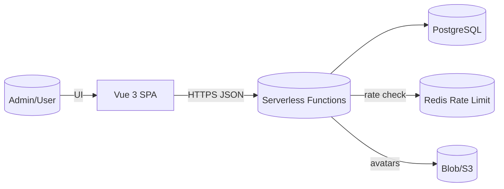
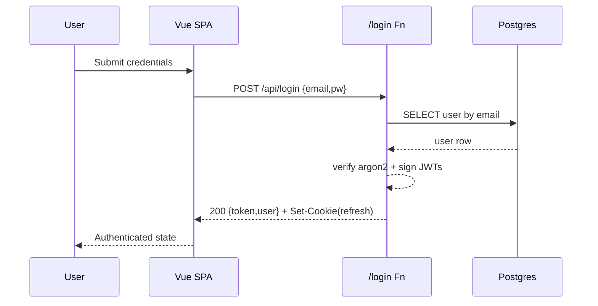

# Project Architecture Blueprint

Generation Context: Full‑Stack Mini App — User Management (Vue 3 SPA + Vercel Serverless Node.js + PostgreSQL + Prisma). This blueprint serves as a definitive reference for maintaining architectural consistency, enabling onboarding, and guiding extension.

Configuration Variables Applied

- PROJECT_TYPE: Node.js + Vue (frontend) (manually specified)
- ARCHITECTURE_PATTERN: Serverless + Layered (Hexagonal influences)
- DIAGRAM_TYPE: C4 (context, container, component textual + Mermaid sketches)
- DETAIL_LEVEL: Comprehensive
- INCLUDES_CODE_EXAMPLES: true (illustrative, not exhaustive)
- INCLUDES_IMPLEMENTATION_PATTERNS: true
- INCLUDES_DECISION_RECORDS: true
- FOCUS_ON_EXTENSIBILITY: true

---

## 1. Architecture Detection and Analysis

### Technology Stack Identified

- Frontend: Vue 3, Vite, Pinia (state), Vue Router, Naive UI (UI kit), optional Tailwind.
- Backend: Vercel Serverless Functions (Node.js, TypeScript), Prisma ORM, jsonwebtoken, argon2, possible Upstash Redis (rate limiting), optional Vercel Blob / S3 adapter.
- Database: PostgreSQL (managed: Neon / Vercel Postgres).
- Tooling: Prisma migrations, GitHub Actions (optional), Vercel deployment orchestrator, ESLint/TypeScript (implied), JWT-based stateless auth + refresh token cookie.

### Architectural Pattern Signals

- Serverless deployment shape: each API endpoint as isolated function = micro-endpoint architecture behind unified route prefix /api.
- Layered separation (Presentation -> Application -> Domain -> Infrastructure) implicit via file segmentation (functions importing shared libs: auth, prisma, response).
- Hexagonal influences: Infrastructure adapters (Prisma, Redis, Blob storage) are accessed via wrapper utilities enabling substitution.
- Stateless compute with boundary at each HTTP invocation; session continuity managed via JWT tokens (access + refresh).

### Dependency Flow

- Frontend depends on Backend HTTP + CORS.
- Backend functions depend on shared libs (auth, prisma, response) which depend on external libraries and environment variables.
- No cyclic dependencies expected: utilities are leaf providers; functions do not depend on each other (composition via shared libs only).

### Communication Mechanisms

- HTTP/JSON synchronous requests between SPA and serverless endpoints.
- Optional asynchronous events (future extension) not currently implemented (e.g., audit log emission currently synchronous DB inserts).

---

## 2. Architectural Overview

The system is a lean Serverless + SPA architecture optimized for rapid iteration and low operational overhead. The frontend renders authenticated user management screens and delegates all data mutations and secure logic to the backend. The backend is comprised of discrete, stateless serverless functions each encapsulating a bounded responsibility (auth, user CRUD, token refresh, profile operations, optional avatar upload).

Guiding Principles

1. Security by default (strict CORS, httpOnly refresh cookie, argon2id hashing, minimal token scope).
2. Simplicity over abstraction (only introduce layers where isolation yields measurable benefit).
3. Observability-ready (clear extension points for logging, audit, metrics).
4. Extensibility (pluggable storage for avatars, add-on audit logging, feature toggles).
5. Performance via minimal cold start overhead (shared Prisma client reuse, concise dependencies).

Architectural Boundaries

- Presentation Boundary: Browser (Vue SPA) and Fetch/Axios client.
- Service Boundary: /api serverless functions set; each function independent except for shared libraries.
- Domain Boundary: User entity and invariants (roles, activation rules, self‑demotion constraints) enforced in application logic.
- Infrastructure Boundary: Data persistence (Postgres via Prisma), cache/rate limit provider, storage provider, environment configuration.

Hybrid Adaptations

- Combines Layered (clear progression from HTTP handler -> app logic -> persistence) with Hexagonal (abstracted adapters for cross‑cutting infra) inside a Serverless delivery model.

---

## 3. Architecture Visualization (C4)

### 3.1 Context Diagram (C1) – Textual

Actors:

- Admin User / Standard User (browser) → interacts with SPA.
- SPA → communicates via HTTPS JSON with Vercel API routes.
External Services: PostgreSQL, Optional Redis (rate limit), Optional Blob/S3 Storage, Vercel Platform (deployment, routing).

Flow: User → Browser (SPA) → HTTPS → Serverless Functions → PostgreSQL (+ optionally Redis / Blob) → Response → SPA.

### 3.2 Container Diagram (C2)

Containers:

1. Web SPA (static assets) hosted via Vercel edge static hosting.
2. Serverless API Functions (Runtime: Node.js). Each path /api/* maps to discrete function.
3. PostgreSQL Database (Managed service).
4. Optional Redis Rate Limiter (Upstash) – invoked within auth/login function.
5. Optional Blob / S3 Storage for avatar objects.
6. (Future) CI/CD Pipeline (GitHub Actions) – lint/test before deploy.

### 3.3 Component Diagram (C3) – Selected Backend Components

- Auth Function: validates credentials, issues tokens, sets refresh cookie.
- Refresh Function: rotates refresh token, returns new access token.
- Users Collection Function: list (pagination, filters), create (admin-only).
- User Item Function: get, update, delete (soft) with role rules.
- Me Function: self profile read/update (name/password) with password verification.
- Shared Auth Library: hashing, JWT signing/verification, cookie utilities.
- Shared Prisma Adapter: Singleton client instance for DB operations.
- Response Helper: Standardizes headers (CORS, JSON) + formatting.
- (Optional) Upload Avatar Function: Validates mime/size, stores object, updates avatar URL.
- (Optional) Audit Logger: Simple helper writing records to AuditLog table.

### 3.4 Code (C4) – Logical Runtime Interactions (Sequence Summary)

Login Sequence: Browser Login Form → POST /api/login → Auth Function (User lookup → Argon2 verify → Issue tokens → Set cookie) → 200 w/ access token → Browser stores token in memory.

Mermaid Sketches (Indicative Only)





---

## 4. Core Architectural Components

| Component | Purpose | Key Responsibilities | Interaction | Extension Points |
|-----------|---------|----------------------|-------------|------------------|
| Vue SPA (Presentation) | Deliver UI & state mgmt | Routing, auth state, table filters | Axios → API | Add views, plug new routes, feature flags |
| Auth Function | Authentication & token issuance | Validate credentials, rate limiting, set refresh cookie | DB user table, Argon2, JWT | Alternate IdP integration (OAuth) |
| Refresh Function | Token refresh & rotation | Verify refresh cookie, reissue tokens | JWT verify, DB (user active check) | Extend with token revocation store |
| Users Functions | User CRUD list & item ops | Pagination, search, create, update, soft delete rules | Prisma, Auth roles | Add extended filters / exports |
| Me Function | Self profile mgmt | Return and update own data, password change | Prisma | Add multi-factor toggles |
| Upload Avatar (Optional) | Media ingestion | Validate file, store blob, persist URL | Blob/S3 API | Virus scan pipeline |
| Audit Logger (Optional) | Compliance trace | Append audit rows | Prisma AuditLog | Streaming to external SIEM |
| Prisma Adapter | Data access abstraction | DB connection reuse | PostgreSQL | Swap DB provider (Cockroach) |
| Auth Library | Security primitives | Hash/verify, sign/verify JWT, cookies | Argon2, JWT libs | Add JWE, key rotation |
| Rate Limiter (Optional) | Brute force defense | Sliding window or token bucket | Redis | Replace with edge rate limiting |

---

## 5. Architectural Layers and Dependencies

Layers (logical):

1. Presentation (Vue components, Pinia store, router guards).
2. Application (Serverless function handlers orchestrating use cases & enforcing policies).
3. Domain (Core rules: role authorization, self‑demotion prevention, soft deletion semantics).
4. Infrastructure (Prisma ORM, JWT, Argon2, Redis, Blob, environment configuration).

Allowed Directions: Presentation → Application → Domain → Infrastructure. Domain unaware of Infrastructure specifics (expressed via repository/service interfaces conceptually; currently realized through thin direct Prisma usage—can be refactored to interfaces if complexity increases).

No cycles: Each serverless handler is an application layer façade; shared libs (auth/prisma) do not import handlers.

---

## 6. Data Architecture

Primary Entities

- User(id, name, email, passwordHash, roles[], isActive, createdAt, updatedAt, avatarUrl)
- AuditLog(id, actorId?, action, entity, entityId?, payload JSON, createdAt)

Relationships

- User 1─* AuditLog (actorId foreign key; logs may reference same or other users as entityId).

Data Access Patterns

- CRUD via Prisma generated client.
- List queries: filtered on search (contains, case-insensitive), role presence, active flag, sort field with index considerations (indexes on createdAt + maybe email for search performance).

Data Validation

- Email uniqueness DB-level.
- Application-level trimming & lowercasing.
- Password strength enforced pre-hash (extendable policy service).

Caching Strategy

- None by default (queries simple, dataset small). Potential extension: introduce Redis for list caching or rate limiting.

---

## 7. Cross-Cutting Concerns Implementation

| Concern | Current Strategy | Extension Path |
|---------|------------------|----------------|
| Authentication | JWT access + refresh cookie rotation | Add MFA, device binding |
| Authorization | Role array check (admin/user) | Policy engine / ABAC |
| Auditing | Optional DB AuditLog entries | External stream (Kafka) |
| Error Handling | JSON error envelope {error} | Structured problem+json |
| Input Validation | Manual field checks (length, presence) | Central validation layer (Zod/Yup) |
| Logging | Minimal (console, if any) | Structured logger (pino) with redaction |
| Rate Limiting | Optional Upstash per IP/email | Adaptive risk-based throttling |
| Configuration | Environment variables (.env example) | Central config schema validation |
| Security Headers | CORS strict allowlist | CSP, Security headers middleware |
| Observability | Not yet instrumented | Add OpenTelemetry traces, metrics |

---

## 8. Service Communication Patterns

All communication is synchronous REST over HTTPS using JSON. The serverless endpoints act as a coarse-grained API surface (monolithic logical service) rather than a mesh of microservices. No internal service discovery required (Vercel routing layer). Future asynchronous patterns (e.g., event emission on AuditLog) can be layered in via message broker without changing client contract.

Versioning Strategy: Single version initially; introduce /v2 namespace if breaking changes accumulate. Use additive fields to preserve backward compatibility.

Resilience: Stateless functions allow horizontal scaling; failures isolated per request; minimal shared state reduces blast radius. Token verification performance is O(1); database throughput is primary scaling concern.

---

## 9. Technology-Specific Architectural Patterns

### Node.js Serverless Patterns

- Cold Start Mitigation: Reuse Prisma client in a global variable to avoid connection storm.
- Stateless Handlers: Each function reconstructs auth context from headers/cookies.
- Minimal Middleware: Implement ad hoc utilities instead of heavy frameworks (e.g., no Express) for latency.

### Vue 3 Patterns

- Component Composition: Views composed of smaller table/form components; script setup for concise SFCs.
- State Management: Pinia store holds auth token & user; ephemeral in-memory plus optional persistence via localStorage.
- Routing Guards: Role enforcement executed before navigation for protected routes.

---

## 10. Implementation Patterns

### Interface Design Patterns

- Encapsulate security primitives (hash, verify, sign, verify tokens) behind a single auth utility to simplify replacement.
- Environment configuration accessed via wrapper enabling central validation.

### Service / Handler Pattern

- Pattern: (Parse Input) → (Authorize) → (Validate) → (Execute Use Case) → (Transform Output) → (Emit Side Effects) → (Respond).

### Repository Pattern (Lightweight)

- Direct Prisma usage; domain logic kept above queries; can evolve into full repository abstraction if business rules densify.

### Error Handling Pattern

- Standard JSON error shape; map status codes (400 validation, 401 auth, 403 permission, 404 not found, 409 conflict, 500 fallback).

### Token Management Pattern

- Access token short-lived; refresh rotation ensures compromised refresh invalidates sooner (consider jti store for full revocation if required later).

### Soft Delete Pattern

- Active filter integrated in list queries; destructive operations must use update (isActive=false) and disallow self deactivation.

---

## 11. Testing Architecture

Testing Layers

- Unit: Auth utilities (hash/verify, sign/verify), role enforcement helpers.
- Integration: Serverless handlers with in-memory or test Postgres (Docker) verifying end-to-end flows (login, refresh, CRUD, permission edge cases).
- E2E: Playwright or Cypress scenario: login → list users → search → attempt forbidden action.

Test Data Strategy

- Seed admin user via migration or test fixture script.
- Use unique emails per test to avoid constraint collisions.

Mocking

- Replace external services (Redis, Blob) with in-memory stubs in integration tests.

---

## 12. Deployment Architecture

Topology

- Vercel: Static hosting of SPA + on-demand Node.js functions sharing region; Postgres in nearby region for latency.
- Environment Promotion: dev (preview deploys), staging (protected branch), production (main branch). Each environment has distinct DATABASE_URL & JWT secrets.

Configuration Management

- Environment variables configured per environment in Vercel dashboard; .env.example documents required keys.

Scalability Considerations

- Serverless concurrency scales horizontally; ensure Postgres connection limits respected (Prisma pool + pgbouncer if needed).
- Heavy list queries can adopt caching or pagination keyset strategies if dataset grows.

---

## 13. Extension and Evolution Patterns

Feature Addition Guidelines

1. Define user story & acceptance criteria.
2. Add domain rule (if needed) near existing authorization logic.
3. Introduce new function under /api/`<feature>`.ts or extend existing resource module when cohesive.
4. Update Pinia store or create new module store for stateful features; keep store lean.
5. Add tests at relevant layers (unit/integration/E2E) before merging.

Variation Points

- Storage Adapter: Abstract avatar storage to allow local dev disk vs. S3 in prod.
- Rate Limiter Strategy: Switch sliding window to token bucket by replacing limiter module.
- Audit Emission: Replace synchronous DB insert with asynchronous queue publish.

Deprecation Strategy

- Mark old endpoints with Warning header, provide sunset timeline, maintain at least one minor release overlap.

---

## 14. Architectural Pattern Examples (Illustrative)

Example: Authorization Guard (Conceptual Pseudocode)

```ts
function requireRole(user, roles){
  if(!user) throw AuthError();
  if(!roles.some(r => user.roles.includes(r))) throw ForbiddenError();
}
```

Example: Soft Delete Query Filter (Conceptual)

```ts
const baseUserSelect = { where: { isActive: true } };
```

Example: Paginated Listing Pattern (Conceptual)

```ts
const page = Math.max(1, req.query.page || 1);
const size = Math.min(50, Math.max(1, req.query.size || 10));
// compute skip = (page-1)*size
```

---

## 15. Architectural Decision Records

| ID | Decision | Context | Options Considered | Rationale | Consequences |
|----|----------|---------|--------------------|-----------|--------------|
| ADR-001 | Serverless Functions on Vercel | Need low-ops scaling | Dedicated Node server, Containers | Zero infra mgmt, rapid deploy | Cold start risk; function granularity |
| ADR-002 | PostgreSQL + Prisma | Need relational store + TS types | MySQL, MongoDB | Strong relational + tooling | SQL migrations maintained |
| ADR-003 | JWT Access + Refresh | Stateless auth required | Session store, Access-only JWT | Scalability & rotation security | Need refresh cookie hardening |
| ADR-004 | Argon2id Hashing | Password security | bcrypt | Memory-hard defense | Slightly higher CPU cost |
| ADR-005 | Vue 3 + Pinia | Modern reactive UI | React + Redux, Angular | Familiarity, smaller bundle | Vue-specific skill needed |
| ADR-006 | Soft Delete Users | Preserve audit & recovery | Hard delete | Reversible & historical | Must filter inactive everywhere |
| ADR-007 | Role Array (user/admin) | Simple RBAC | Granular permissions table | Minimizes complexity | Harder future fine-grain perms |

---

## 16. Architecture Governance

Mechanisms

- Review Checklist: Security headers, role validation, input validation, rate limit presence for auth endpoints.
- Automated Checks: Lint + (future) architectural ESLint rules (e.g., forbid handlers importing other handlers).
- Documentation Update Policy: Blueprint updated upon any new ADR creation or major feature introduction.

Compliance Monitoring

- CI pipeline can parse import graphs (madge) to detect cycles & forbidden imports.

---

## 17. Blueprint for New Development

Development Workflow Template

1. Open issue with clear acceptance criteria.
2. Draft/update relevant ADR if architectural deviation occurs.
3. Create feature branch; scaffold new serverless function (copy minimal handler template: parse → authorize → validate → execute → respond).
4. Add validation & authorization early; write unit tests for new domain rules.
5. Update SPA: add route, store interactions, UI components with accessibility considerations.
6. Run test suite (unit/integration/E2E) locally and in CI.
7. Update README / docs if public interface changes.

Implementation Templates (Conceptual)

- Handler: Input Parsing → Guard → Use Case Invocation → DTO Mapping → JSON Response.
- Use Case: Validate invariants → Orchestrate repositories → Return domain-safe object.
- Repository: Provide narrow, intention-revealing methods (e.g., findActiveUserByEmail, listUsersFiltered).

Common Pitfalls

- Forgetting soft delete filter → exposes inactive users.
- Storing refresh token in localStorage (security risk) instead of httpOnly cookie.
- Missing index for newly added sortable column → performance degradation.
- Allowing self-demotion inadvertently by bypassing role check.

Performance Considerations

- Add composite indexes if new frequent filters appear (e.g., role + isActive).
- Consider keyset pagination for very large user datasets.

Keeping Blueprint Updated

- Append new ADRs when introducing non-trivial technology or pattern changes.
- Review architecture quarterly or before major version increments.

---

## Appendix

Glossary

- ADR: Architectural Decision Record.
- DTO: Data Transfer Object.
- RBAC: Role-Based Access Control.
- CORS: Cross-Origin Resource Sharing.

Change Log

- v1.0: Initial comprehensive blueprint created.

End of Document.
