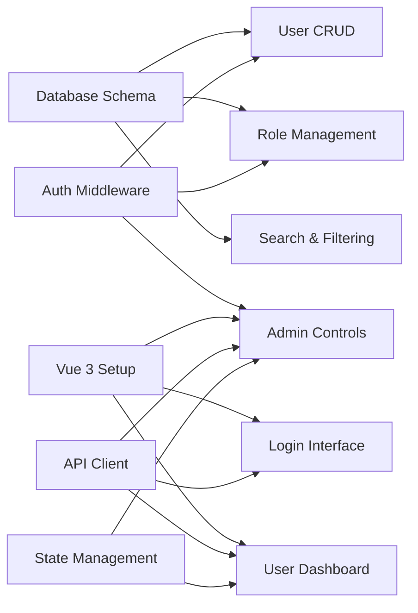

# User Management System - GitHub Project Plan

## 1. Project Overview

### Feature Summary

Build a comprehensive user management mini-application with authentication, role-based access control, and data table management. The system provides secure user administration capabilities with JWT-based authentication, soft delete functionality, and advanced filtering/pagination.

### Success Criteria

- **Authentication System**: 99.9% uptime for login/logout flows with <200ms response times
- **Role Management**: 100% enforcement of admin/user permissions with zero privilege escalation incidents
- **Data Management**: Support for 10,000+ users with <1s query response times
- **Security Compliance**: Zero exposed password hashes, secure cookie handling, argon2id encryption
- **User Experience**: <3 clicks to perform any core user management task

### Key Milestones

1. **Foundation Setup**: Core infrastructure, database schema, and authentication system
2. **Backend API**: Complete REST API with all endpoints and security measures
3. **Frontend Application**: Vue 3 SPA with complete user interface and state management
4. **Integration & Testing**: End-to-end testing, security validation, and performance optimization
5. **Deployment & Monitoring**: Production deployment with observability and documentation

### Risk Assessment

| Risk | Impact | Probability | Mitigation |
|------|---------|-------------|------------|
| JWT Security Vulnerabilities | High | Low | Implement refresh token rotation, secure httpOnly cookies |
| Database Performance Issues | Medium | Medium | Implement proper indexing, pagination limits |
| Frontend State Management Complexity | Medium | Low | Use Pinia with clear store patterns |
| Vercel Serverless Cold Starts | Low | High | Implement Prisma client reuse pattern |

## 2. Work Item Hierarchy

```mermaid
graph TD
    A[Epic: User Management System] --> B[Feature: Authentication & Security]
    A --> C[Feature: User Administration]
    A --> D[Feature: Frontend Application]
    A --> E[Feature: Infrastructure & DevOps]

    B --> F[Story: JWT Authentication]
    B --> G[Story: Token Refresh System]
    B --> H[Story: Password Security]
    B --> I[Enabler: Security Middleware]

    C --> J[Story: User CRUD Operations]
    C --> K[Story: Role Management]
    C --> L[Story: Soft Delete System]
    C --> M[Story: Search & Pagination]
    C --> N[Enabler: Database Schema]

    D --> O[Story: Login Interface]
    D --> P[Story: User Dashboard]
    D --> Q[Story: Admin Controls]
    D --> R[Enabler: State Management]
    D --> S[Enabler: API Integration]

    E --> T[Story: Vercel Deployment]
    E --> U[Story: Database Setup]
    E --> V[Enabler: CI/CD Pipeline]
    E --> W[Enabler: Monitoring Setup]
```



## 3. GitHub Issues Breakdown

### Epic Issue

**Title**: Epic: User Management System  
**Labels**: `epic`, `priority-high`, `value-high`  
**Estimate**: XL (80-100 story points)

```markdown
# Epic: User Management System

## Epic Description
Develop a secure, scalable user management application with role-based access control, JWT authentication, and comprehensive admin capabilities. The system will serve as a foundation for user administration with modern security practices and intuitive user experience.

## Business Value
- **Primary Goal**: Provide secure user administration capabilities with role-based permissions
- **Success Metrics**: 
  - 99.9% authentication system uptime
  - <200ms average API response times
  - Zero security incidents or privilege escalations
  - Support for 10,000+ users with sub-second query performance
- **User Impact**: Administrators can efficiently manage users while maintaining strict security controls

## Epic Acceptance Criteria
- [ ] Complete JWT-based authentication with refresh token rotation
- [ ] Role-based access control (admin/user) fully implemented
- [ ] Soft delete system preventing data loss
- [ ] Advanced search, filtering, and pagination capabilities
- [ ] Production-ready deployment on Vercel with PostgreSQL
- [ ] Comprehensive security measures (argon2id, CORS, rate limiting)

## Features in this Epic
- [ ] #AUTH-001 - Authentication & Security System
- [ ] #ADMIN-001 - User Administration Features
- [ ] #UI-001 - Frontend Application
- [ ] #INFRA-001 - Infrastructure & DevOps

## Definition of Done
- [ ] All feature stories completed and tested
- [ ] End-to-end security audit passed
- [ ] Performance benchmarks met (sub-second queries)
- [ ] Documentation complete (README, API docs, deployment guide)
- [ ] Production deployment successful with monitoring

## Milestone
v1.0 - User Management MVP
```

### Feature Issues

#### Feature: Authentication & Security System

**Labels**: `feature`, `priority-critical`, `value-high`, `backend`, `security`  
**Estimate**: L (25-30 story points)

**User Stories**:

- **AUTH-S001**: JWT Authentication Flow (5 pts)
- **AUTH-S002**: Token Refresh & Rotation (5 pts)
- **AUTH-S003**: Password Security & Hashing (3 pts)
- **AUTH-S004**: Rate Limiting Protection (5 pts)

**Technical Enablers**:

- **AUTH-E001**: Authentication Middleware (8 pts)
- **AUTH-E002**: Security Headers & CORS (3 pts)

#### Feature: User Administration

**Labels**: `feature`, `priority-high`, `value-high`, `backend`  
**Estimate**: L (30-35 story points)

**User Stories**:

- **ADMIN-S001**: User CRUD Operations (8 pts)
- **ADMIN-S002**: Role Assignment & Management (5 pts)
- **ADMIN-S003**: Soft Delete Implementation (5 pts)
- **ADMIN-S004**: Advanced Search & Filtering (8 pts)
- **ADMIN-S005**: Pagination System (3 pts)

**Technical Enablers**:

- **ADMIN-E001**: Database Schema & Migrations (8 pts)
- **ADMIN-E002**: Prisma ORM Integration (5 pts)

#### Feature: Frontend Application

**Labels**: `feature`, `priority-high`, `value-high`, `frontend`  
**Estimate**: L (25-30 story points)

**User Stories**:

- **UI-S001**: Login & Authentication Interface (5 pts)
- **UI-S002**: User Dashboard & Table (8 pts)
- **UI-S003**: Admin Control Panel (8 pts)
- **UI-S004**: User Profile Management (5 pts)

**Technical Enablers**:

- **UI-E001**: Vue 3 Application Setup (3 pts)
- **UI-E002**: Pinia State Management (5 pts)
- **UI-E003**: API Client & Interceptors (5 pts)
- **UI-E004**: UI Component Library Integration (3 pts)

#### Feature: Infrastructure & DevOps

**Labels**: `feature`, `priority-medium`, `value-medium`, `infrastructure`  
**Estimate**: M (15-20 story points)

**User Stories**:

- **INFRA-S001**: Vercel Deployment Configuration (3 pts)
- **INFRA-S002**: Database Provisioning (3 pts)
- **INFRA-S003**: Environment Configuration (2 pts)

**Technical Enablers**:

- **INFRA-E001**: CI/CD Pipeline Setup (8 pts)
- **INFRA-E002**: Monitoring & Logging (5 pts)
- **INFRA-E003**: Security Scanning (3 pts)

## 4. Priority and Value Matrix

| Issue ID | Title | Priority | Value | Component | Estimate |
|----------|-------|----------|-------|-----------|----------|
| AUTH-E001 | Authentication Middleware | P0 | High | Backend | 8 pts |
| ADMIN-E001 | Database Schema | P0 | High | Backend | 8 pts |
| AUTH-S001 | JWT Authentication Flow | P0 | High | Backend | 5 pts |
| AUTH-S002 | Token Refresh System | P0 | High | Backend | 5 pts |
| UI-E001 | Vue 3 Application Setup | P1 | High | Frontend | 3 pts |
| ADMIN-S001 | User CRUD Operations | P1 | High | Backend | 8 pts |
| UI-S001 | Login Interface | P1 | High | Frontend | 5 pts |
| UI-S002 | User Dashboard | P1 | High | Frontend | 8 pts |
| ADMIN-S002 | Role Management | P1 | High | Backend | 5 pts |
| AUTH-S003 | Password Security | P1 | High | Backend | 3 pts |
| UI-E002 | State Management | P2 | Medium | Frontend | 5 pts |
| ADMIN-S003 | Soft Delete System | P2 | Medium | Backend | 5 pts |
| UI-S003 | Admin Controls | P2 | Medium | Frontend | 8 pts |
| ADMIN-S004 | Search & Filtering | P2 | Medium | Backend | 8 pts |
| INFRA-S001 | Vercel Deployment | P2 | Medium | Infrastructure | 3 pts |
| AUTH-S004 | Rate Limiting | P3 | Low | Backend | 5 pts |
| INFRA-E001 | CI/CD Pipeline | P3 | Low | Infrastructure | 8 pts |

## 5. Estimation Guidelines

### Story Point Reference

- **1-2 points**: Configuration changes, simple utilities (<4 hours)
- **3-5 points**: Standard features, API endpoints (1-2 days)
- **8 points**: Complex features, integration work (3-5 days)
- **13+ points**: Epic-level work requiring breakdown

### Sprint Capacity Planning

- **Team Size**: 2-3 developers (full-stack capable)
- **Sprint Duration**: 2 weeks
- **Expected Velocity**: 20-30 story points per sprint
- **Buffer**: 20% capacity reserved for bug fixes and unexpected work

## 6. Dependency Management

### Critical Path Dependencies

1. **Database Schema** (ADMIN-E001) → All backend stories
2. **Authentication Middleware** (AUTH-E001) → All protected endpoints
3. **Vue 3 Setup** (UI-E001) → All frontend stories
4. **API Client Setup** (UI-E003) → Frontend-backend integration

### Dependency Matrix



## 7. Sprint Planning Template

### Sprint 1: Foundation (Week 1-2)

**Sprint Goal**: Establish core infrastructure and authentication system  
**Capacity**: 25 story points

**Stories**:

- AUTH-E001: Authentication Middleware (8 pts)
- ADMIN-E001: Database Schema & Migrations (8 pts)
- AUTH-S001: JWT Authentication Flow (5 pts)
- UI-E001: Vue 3 Application Setup (3 pts)

**Success Criteria**: Users can register/login with JWT tokens, database schema deployed

### Sprint 2: Core Features (Week 3-4)

**Sprint Goal**: Implement user management and basic UI  
**Capacity**: 25 story points

**Stories**:

- ADMIN-S001: User CRUD Operations (8 pts)
- AUTH-S002: Token Refresh System (5 pts)
- UI-S001: Login Interface (5 pts)
- UI-E002: State Management Setup (5 pts)
- AUTH-S003: Password Security (3 pts)

**Success Criteria**: Complete user management backend, functional login interface

### Sprint 3: Admin Features (Week 5-6)

**Sprint Goal**: Build admin dashboard and advanced features  
**Capacity**: 25 story points

**Stories**:

- UI-S002: User Dashboard & Table (8 pts)
- ADMIN-S002: Role Management (5 pts)
- UI-E003: API Client Integration (5 pts)
- ADMIN-S003: Soft Delete System (5 pts)
- UI-S004: User Profile Management (3 pts)

**Success Criteria**: Admin can manage users through complete UI

### Sprint 4: Enhancement & Deployment (Week 7-8)

**Sprint Goal**: Advanced features and production deployment  
**Capacity**: 25 story points

**Stories**:

- ADMIN-S004: Search & Filtering (8 pts)
- UI-S003: Admin Control Panel (8 pts)
- INFRA-S001: Vercel Deployment (3 pts)
- ADMIN-S005: Pagination System (3 pts)
- AUTH-S004: Rate Limiting (5 pts)

**Success Criteria**: Production-ready system with all features deployed

## 8. GitHub Project Board Configuration

### Column Structure

1. **Epic Backlog**: High-level features awaiting breakdown
2. **Story Ready**: Detailed stories ready for development
3. **Sprint Backlog**: Stories committed to current sprint
4. **In Progress**: Active development work
5. **Code Review**: Completed development awaiting review
6. **Testing**: QA validation and acceptance testing
7. **Done**: Completed and deployed features

### Custom Fields

- **Priority**: P0 (Critical), P1 (High), P2 (Medium), P3 (Low)
- **Value**: High, Medium, Low
- **Component**: Frontend, Backend, Infrastructure, Security
- **Story Points**: 1, 2, 3, 5, 8, 13
- **Sprint**: Sprint 1, Sprint 2, Sprint 3, Sprint 4
- **Epic**: Link to parent epic
- **Dependencies**: Blocking/blocked by relationships

## 9. Success Metrics

### Development KPIs

- **Sprint Commitment Accuracy**: >85% of committed story points completed
- **Cycle Time**: Average 3-5 days from "In Progress" to "Done"
- **Lead Time**: Average 1-2 weeks from "Story Ready" to "Done"
- **Defect Rate**: <5% of stories require rework after completion
- **Velocity Consistency**: ±20% variance between sprint velocities

### Product KPIs

- **Authentication Success Rate**: >99.5% successful login attempts
- **API Response Time**: <200ms for 95th percentile
- **Search Performance**: <1 second for complex queries
- **Security Compliance**: Zero password hash exposures
- **User Experience**: <3 clicks for any admin task

### Deployment KPIs

- **Deployment Frequency**: Multiple deploys per week
- **Change Failure Rate**: <5% deployments require rollback
- **Recovery Time**: <1 hour for critical issues
- **Feature Flag Coverage**: 100% new features behind flags
